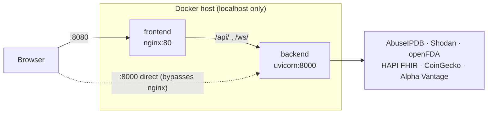
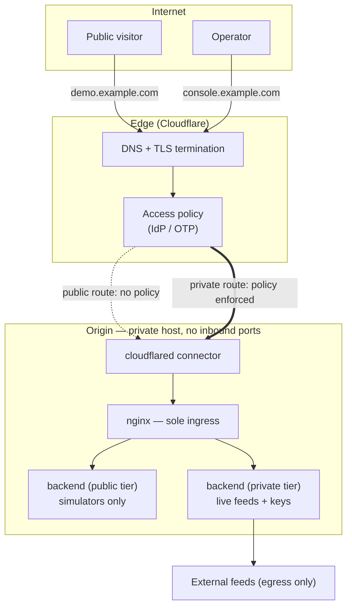

# Aegis IOC — Private + Public Tunnel Architecture

Status: **draft**. Nothing in this document is implemented yet.

Scope note: Tailscale and MagicDNS are tracked as a separate project and are
deliberately out of scope here. This design assumes no mesh VPN, no overlay DNS,
and no client-side agent — the only path from the internet to the origin is the
outbound tunnel described below.

---

## 1. Earlier architecture (baseline on `origin/main`)

The architecture already on the remote is sound: a single reverse proxy fronting
a stateless API, JWT auth with per-domain scopes, default-deny on the WebSocket
handshake, and external feeds that degrade to simulators instead of failing. The
issue is not correctness — it is that the exposure model carries two ingress
paths and two overlapping gateway layers, which does not survive contact with a
public hostname. It needed simplification before a tunnel could be attached.

### 1.1 As-built topology



| Component | Location | Notes |
|---|---|---|
| nginx SPA + proxy | `frontend/nginx.conf:1-26` | `listen 80`, SPA fallback, proxies `/api/` and `/ws/` (upgrade headers set) |
| FastAPI app | `backend/app/main.py:93-122` | routers mounted under `/api/v1`, WS router unprefixed, `/health` unauthenticated |
| Gateway middleware | `backend/app/main.py:34-46` | `SecurityHeadersMiddleware` — nosniff, `X-Frame-Options: DENY`, referrer policy, CSP |
| CORS | `backend/app/main.py:103-109` | `allow_credentials=True`, methods/headers `*`, origins from settings |
| Auth | `backend/app/auth/security.py` | HS256 JWT, `iss=aegis-idp`, `aud=aegis-api`, 8h TTL, scope string |
| WS authz | `backend/app/ws/routes.py:25-41` | token via **query param**, scope checked pre-accept, default-deny |
| Runtime | `backend/app/core/runtime.py` | broadcaster + per-domain ring-buffer stores (`store_capacity: 5000`) |
| Egress | `backend/app/config.py:41-67` | six external feeds, all outbound, graceful fallback to simulator |

### 1.2 What the tunnel design changes, and why

| # | Baseline | Change | Reason |
|---|---|---|---|
| 1 | Backend published `8000:8000` to the host | **Done** — host port dropped, backend `expose`d on the compose network only | Two ingress paths means the nginx-enforced edge policy is optional. One door or the policy is decorative. |
| 2 | Security headers set in FastAPI middleware | Keep them, but treat nginx as the authority for edge headers (HSTS, CSP) | Headers must apply to static SPA responses too, which never touch FastAPI |
| 3 | CORS list hand-maintained per environment | Derive from the deployment tier (one public origin, one private origin) | `allow_credentials=True` with a loose origin list is the classic cookie-theft setup |
| 4 | Single stack serves everything | Split into two tiers off one image, separated by env flags only | Avoids a forked codebase; the public tier is the same build with capabilities switched off |
| 5 | WS token in query string | Move to `Sec-WebSocket-Protocol` subprotocol or a short-lived ticket | Query strings land in proxy access logs, edge analytics, and `Referer` — see §5 |

---

## 2. Target architecture

Two hostnames, one origin, one outbound tunnel. The origin has no public IP, no
port-forward, and no inbound firewall rule — the connector dials out and the
edge multiplexes over that connection.



### 2.1 Tier split

| | Public tier (`demo.*`) | Private tier (`console.*`) |
|---|---|---|
| Edge policy | none — open | Access policy, allowlisted identities |
| Auth | demo login, read-only scopes | full IdP, all scopes |
| Data | simulators only | simulators + live external feeds |
| API keys | none mounted | mounted from secret store |
| Env | `AEGIS_ENABLE_SIMULATORS=true`, all `enable_live_*=false` | live flags on, keys present |
| CORS | `["https://demo.example.com"]` | `["https://console.example.com"]` |
| Secret key | tier-specific, generated | tier-specific, generated |
| Write routes | disabled | enabled |

Same image, different env. No second codebase.

### 2.2 Trust boundaries

1. **Edge → connector.** Cloudflare-terminated TLS; the connector's outbound
   session is the only channel inward. Nothing else may reach the origin.
2. **Connector → nginx.** Loopback/compose-network HTTP. Not a trust boundary in
   itself — it inherits whatever the edge let through, which is why the edge
   policy must be complete before this hop.
3. **nginx → backend.** The backend must not trust `X-Forwarded-*` blindly; only
   the connector-set forwarded headers are meaningful, and only after nginx
   normalizes them.
4. **Backend → external feeds.** Egress only, already in place, unchanged.

The important property: the public tier and the private tier share an origin
host but must not share a JWT signing key. A token minted by the demo tier must
be worthless against the console tier — different `AEGIS_SECRET_KEY` per tier
gives that for free, since `decode_access_token` verifies signature, `iss`, and
`aud`.

---

## 3. Origin changes required

### 3.1 Compose

```yaml
services:
  backend:
    build: ./backend
    # no ports: — reachable only via the compose network
    environment:
      AEGIS_SECRET_KEY: ${AEGIS_SECRET_KEY:?set per tier}
      AEGIS_ENVIRONMENT: ${AEGIS_TIER}
      AEGIS_CORS_ORIGINS: '["https://${AEGIS_HOSTNAME}"]'
      AEGIS_ENABLE_SIMULATORS: "true"
      AEGIS_ENABLE_LIVE_CYBER: "${LIVE_FEEDS}"
      AEGIS_ENABLE_LIVE_HEALTH: "${LIVE_FEEDS}"
      AEGIS_ENABLE_LIVE_FINTECH: "${LIVE_FEEDS}"

  frontend:
    build: ./frontend
    depends_on: [backend]
    # no ports: — the connector reaches it on the compose network

  tunnel:
    image: cloudflare/cloudflared:latest
    command: tunnel --no-autoupdate run
    environment:
      TUNNEL_TOKEN: ${TUNNEL_TOKEN:?required}
    depends_on: [frontend]
    restart: unless-stopped
```

`${AEGIS_SECRET_KEY:?}` and `${TUNNEL_TOKEN:?}` fail the stack rather than
falling back to a default. That is deliberate — see §5.

### 3.2 nginx

Additions to `frontend/nginx.conf`:

- `proxy_set_header X-Forwarded-Proto $http_x_forwarded_proto;` so the backend
  sees the real scheme through the tunnel.
- WebSocket `proxy_read_timeout`/`proxy_send_timeout` raised past the idle
  interval — the current config sets upgrade headers but leaves the default
  60s read timeout, which will cut idle domain streams. The health channel at
  `health_heartbeat_ms: 500` is fine; a quiet cyber channel is not guaranteed
  to be.
- `add_header Strict-Transport-Security` at the edge tier only.
- Keep `/health` unauthenticated but do not route it publicly — it leaks
  `environment` and `app_name` (`main.py:118-120`).

### 3.3 Connector routing

One tunnel, two hostname ingress rules, both pointing at the same nginx:

```
demo.example.com     -> http://frontend:80    (no Access policy)
console.example.com  -> http://frontend:80    (Access policy required)
```

Tier separation is by which compose project the hostname resolves to, so in
practice this is two stacks (`demo`, `console`) each with its own connector and
its own `.env`. Running both tiers off one connector is possible but couples
their blast radius; not recommended.

---

## 4. Request paths

**Public read:** visitor → edge TLS → connector → nginx → SPA. XHR to
`/api/v1/...` → nginx → backend → simulator-backed store. No key, no live feed.

**Private live:** operator → edge → Access policy (IdP) → connector → nginx →
SPA → login → JWT (private signing key) → `/ws/{domain}?token=...` → scope check
→ broadcaster channel → snapshot of `store.latest(100)` then live batches.

**Egress:** unchanged — backend → external feeds, outbound only, per-connector
timeout `http_timeout_seconds: 6.0`, fallback to simulator on any error.

---

## 5. Security items — must close before any public hostname exists

These are pre-existing and flagged in the code's own comments. A tunnel does not
introduce them; it makes them reachable.

1. ~~**Hardcoded signing key.**~~ **Closed.** No key ships in the repo. Any
   `AEGIS_ENVIRONMENT` other than `local` refuses to start without
   `AEGIS_SECRET_KEY`; `local` generates an ephemeral per-process key; keys under
   32 chars and the previously-published literal are both rejected
   (`config.py:_resolve_secret_key`, covered by `tests/test_config.py`). Note the
   old literal remains readable in git history, so it must never be reused —
   which is why it is on the refused list rather than merely undocumented.
2. **Demo user store.** `config.py:5-7` and `auth/security.py:23` state the
   demo store keeps plaintext passwords and must be replaced by a real IdP.
   `verify_password` is constant-time, which does not help if the store itself
   is plaintext and public.
3. **WS token in query string.** `ws/routes.py:26` takes `token` as a query
   param. Behind an edge proxy that URL is logged. Move to a subprotocol header
   or a single-use ticket exchanged over the authenticated HTTP session.
4. ~~**Backend host port.**~~ **Closed.** `8000:8000` is gone; the backend is
   `expose`d on the compose network only, so nginx is the sole ingress and its
   edge policy is no longer optional. Direct API access is now the native
   Quickstart path (`uvicorn --port 8000`), which publishes nothing.
5. **`/health` exposure.** Returns `environment` and `app_name` with no auth.
   Keep it for the connector's origin check, block it at the public hostname.
6. **CORS with credentials.** `allow_credentials=True` plus `allow_methods=["*"]`
   is safe only while the origin list is exactly one trusted hostname. Enforce
   that per tier; never let the demo origin appear in the console tier's list.

Items 1 and 2 are not tunnel work — they are prerequisites. Items 1 and 4 are
closed. Item 2 (plaintext demo user store) remains open and still blocks a
public hostname; items 3, 5, and 6 remain open.

---

## 6. Open questions

- Domain: which apex hosts `demo.*` / `console.*`?
- IdP for the private tier: Access with one-time-PIN to an email allowlist is
  the cheapest path; a real OIDC provider replaces `auth/users.py` entirely.
- Does the public tier need login at all, or should it drop to anonymous
  read-only with scopes granted by a static token issued server-side?
- Secret storage on the origin host — `.env` with `0600`, or a real secret
  manager?
